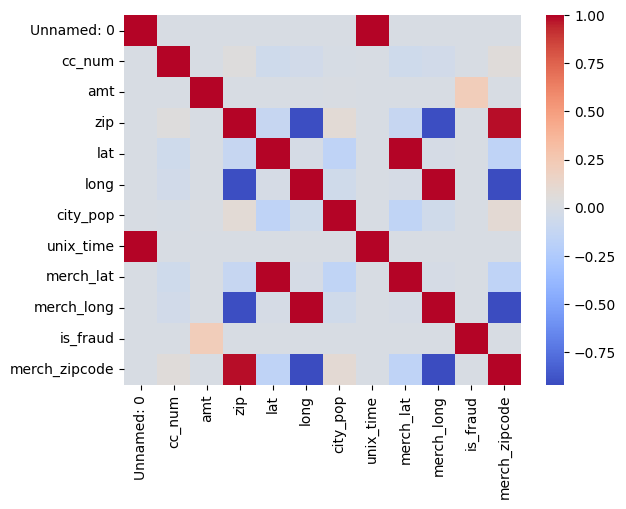
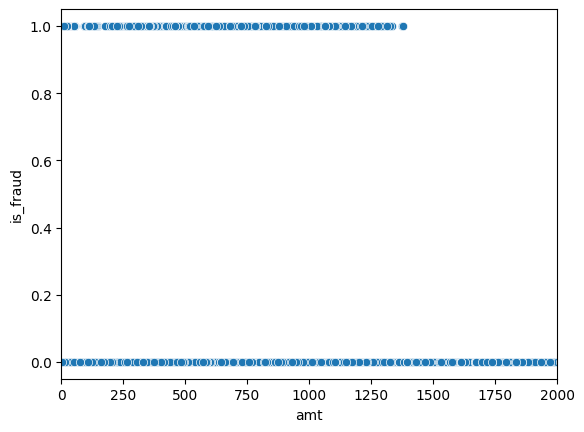
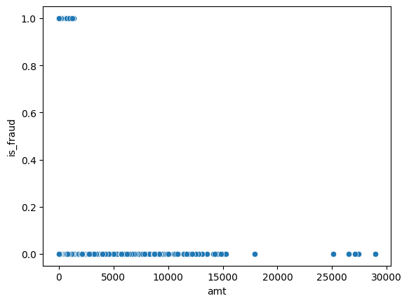
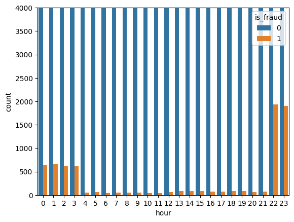

# Fraud Detection Model Documentation
## Introduction
This project is built by me, Aung Kaung. The aim of this project is to get my foot through to the world of fintech related data science, as well as further my understanding of Machine Learning models. This project will be well documented with everything that I did within the project written down in this README file. ENJOY THE REPO.

**DISCLAIMER: PROJECT IS A WORK ON PROGRESS. ONLY AS FAR AS THE DOCUMENTATION REVEALS HAVE BEEN COMPLETED.**


## Roadmap
1) Exploratory Data Analysis
2) Data Cleaning
3) Feature Engineering
4) Train/Test Split
5) Baseline Model
6) Evaluation
7) Model Improvement

---

## 1) Exploratory Data Analysis(EDA):
### Some interesting things from inital EDA of the data set
- Large Dataset (1.2 mil transactions)
- Massive Class Imbalance in "is_fraud" - only 7,506 fraudulent transactions
- `cc-num` unique value is only 983, only 983 unique customers
- `job` unique job is only 494 so pretty diverse range of jobs. model could potentially have trouble generliziing data.

### Hypothesis on the overall project:
1) Fraudulent activity mainly happens at night
2) Some states or some cities might have more fraudulent activies than other
3) When fraud happens, it's mostly in large amounts. Place emphasis on `amt`
4) The bigger the distance between user and merchant, the more likely it is a fraudulent activity

### Sources of non-gereralizable/useless features:
1) `trans_num`  -  pretty useless info that the model could possibly memorize
2) `unix_time`  -  useless number but feature engineer it into exact time stamps later
3) `trans_date_trans_time`  -  again pretty useless and bloated for a model to take in. Feature engieer it into time stamps later
4) `cc_num`  -  useless credit card info. model could memorize.
5) `merch_zipcode`  -  to many different types of data and not generalizable.

### Useful sources of data:
1) `category`
2) `amt`
3) `job`
4) `dob`
5) `city_pop`
6) `gender`
7) `state`

### Possibly useful source of data:
Combine `merch_lat` `merch_long` with `lat` `long`
Use this information to engineer a feature that maybe:
- Distance between merchant and buyer? something to think about later

### Results from Data Visualisation EDA:
**Plot 1:**


- As expected, there is a correlation between `amt` and `is_fraud` *IMPORTANT*
- Designing the model to look towards this correlation is a must now

**Plot 2:**



- This is a very interesting find
- Absurdly large transactions have nothing to do with `is_fraud` being flagged
- Could possibily mean there is nothing to do with `is_fraud` and `amt` ***IMPORTANT***

**Plot 3:**


- This proves that there is a big correlation between newly feature engineering `hour` and `is_fraud`
- As expected, fraudulent activities usually happen at night
- Model should be focused on this, very big.

---

## 2) Data Cleaning
### Key checks for the cleaning process:
1) Missing values
2) Duplicate Rows
3) Data Types
4) Dropping Useless Columns

### 1) Missing Values:
The dataset is very clean has no missing values except for the column `merch_zipcode`.

`merch_zipcode` is not very usable anyways so it will be dropped.

### 2) Duplicate Rows:
Again no duplicate rows so we will be moving on.
Used command:
```python
df.duplicated().sum()
```
Output:
```bash
np.int64(0)
```

### 3) Data Types:
Data types seems about right too. Nothing really to change

| trans_date_trans_time | str     |
|-----------------------|---------|
| cc_num                | int64   |
| merchant              | str     |
| category              | str     |
| amt                   | float64 |
| first                 | str     |
| last                  | str     |
| gender                | str     |
| street                | str     |
| city                  | str     |
| state                 | str     |
| zip                   | int64   |
| lat                   | float64 |
| long                  | float64 |
| city_pop              | int64   |
| job                   | str     |
| dob                   | str     |
| trans_num             | str     |
| unix_time             | int64   |
| merch_lat             | float64 |
| merch_long            | float64 |
| is_fraud              | int64   |
| merch_zipcode         | float64 |

### Column Keep/Engineer/Throw table:
| Columns               | Keeping? | Reason                                                  |
|-----------------------|----------|---------------------------------------------------------|
| `trans_date_trans_time` | Engineer | Feature engineer to useful columns                      |
| `cc_num    `            | No       | High cardinality                                        |
| `merchant`              | Maybe    | Moderate cardinality                                    |
| `category`              | Yes      | Merchant category is often predictive                   |
| `amt  `                 | Yes      | Transaction amount is very important                    |
| `first`                 | No       | Personal identifier                                     |
| `last`                  | No       | Personal identifier                                     |
| `gender`                | No       | Too weak a signal to be useful                          |
| `street`                | No       | Too high cardinality                                    |
| `city   `               | Yes      | Can capture regional activity                           |
| `state   `              | Yes      | Usefuly signal                                          |
| `zip      `             | No       | High cardinality                                        |
| `lat       `            | Engineer | Location useful but feature engineer to distance        |
| `long       `           | Engineer | Location useful but feature engineer to distance        |
| `city_pop    `          | Yes      | Important city signal                                   |
| `job          `         | Maybe    | Cardinality pretty high in this dataset for this column |
| `dob           `        | Engineer | Engineer into age. Very useful signal                   |
| `trans_num      `       | No       | Unique numbers. High cardinality                        |
| `unix_time       `      | No       | Redundant                                               |
| `merch_lat      `       | Engineer | Location useful but feature engineer to distance        |
| `merch_long     `       | Engineer | Location useful but feature engineer to distance        |
| `is_fraud       `       | No       | Main source of leakage                                  |
| `merch_zipcode  `       | No       | Data quality horrible. Too many NA                      |

---

## 3) Feature Engineering
